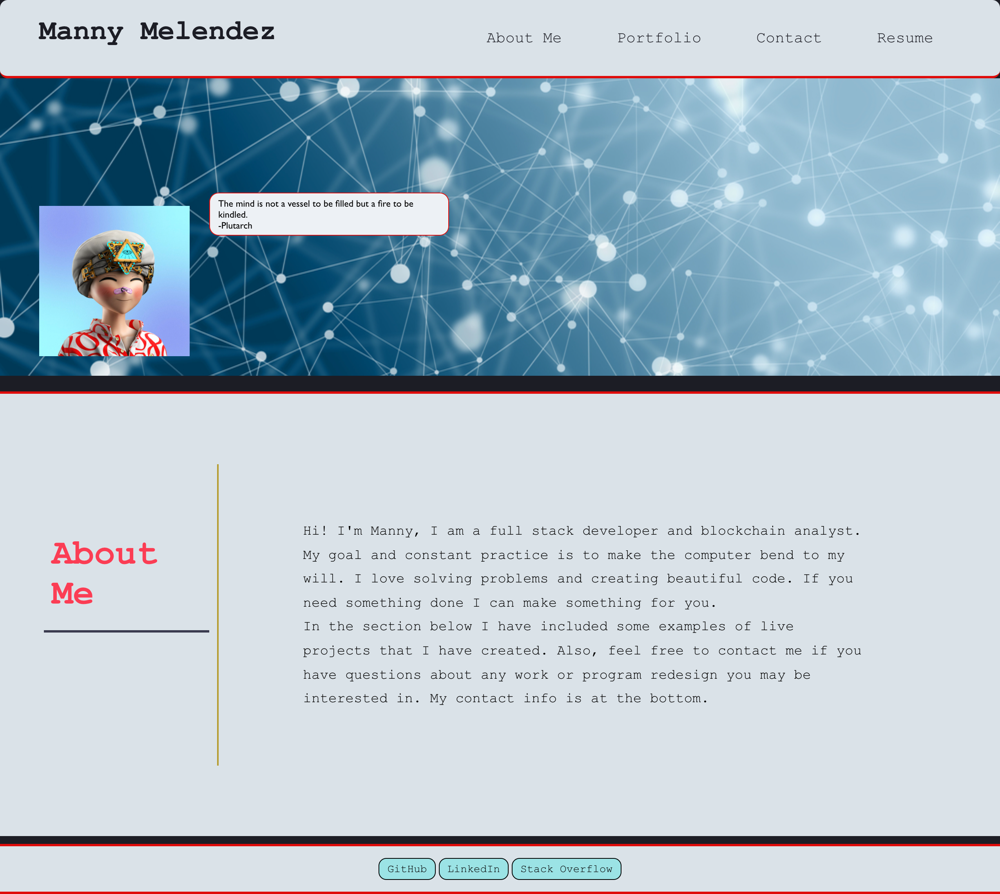

# Manny Melendez React Portfolio

## Description 
This project is a single-page application using React.js to dynamically render content to create a portfolio that includes "About me", "Resume", and "Portfolio" section. 
## Table of Contents
* [Installation](#installation)
* [Usage](#usage)
* [License](#license)
* [Contributing](#contributing)
* [Tests](#tests)
* [Questions](#questions)

## Installation 
The user should clone the repository from GitHub and install dependencies. To run React, run `npm start`. 

## Usage 
This application will allow users view an about me page, links to find me, view my projects, and view my resume. 
Please view deployed application on [Git Hub Pages](https://mmelendez3.github.io/react-portfolio/) 

## License
This application is rendered under MIT

## Contributors
To contribute to budget-tracker, clone this repo locally and commit your code on a separate branch.

## Tests

## Questions
* <strong>Manny Melendez</strong>
    * Email: mele0019@gmail.com
    * Github: [mmelendez3](https://github.com/mmelendez3)